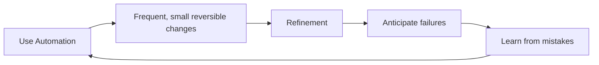

# AWS Well-Architected Framework - Operational Excellence

## Overview

Operational Excellence is one of the five pillars of the AWS Well-Architected Framework. It focuses on running and monitoring systems to deliver business value and continually improving processes and procedures.

## Key Principles

1. **Perform Operations as Code**: Automate operations to reduce human error and increase efficiency.
2. **Annotate Documentation**: Keep documentation up-to-date and accessible.
3. **Make Frequent, Small Changes**: Implement changes in small increments to reduce risk.
4. **Refine Operations**: Continuously improve operational processes based on feedback and metrics.

## Best Practices

- Implement monitoring and alerting to detect issues early.
- Use runbooks for operational procedures.
- Conduct regular reviews and retrospectives to identify areas for improvement.

## Guiding Design Principles

1. Use Automation
2. Frequent, small reversible changes
3. Refinement
4. Ancipate failures
5. Learn from mistakes

