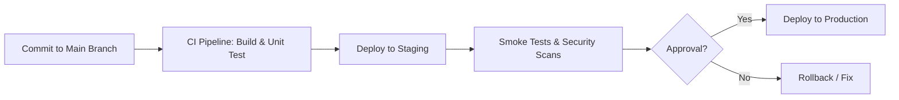

## Deployment Strategy

# 🚀 Deployment Guide

## 📖 Overview

This document describes the deployment strategies, environments, and operational procedures for this service/platform.

The goal is to ensure consistent, safe, and observable deployments across all environments.

---

## 🧩 Environments

| Environment | Purpose                           | Deployment Trigger                        | Notes                          |
| ----------- | --------------------------------- | ----------------------------------------- | ------------------------------ |
| **dev**     | Developer integration and testing | Manual or automated on merge to `develop` | Non-production data            |
| **staging** | Pre-production validation         | Automated on merge to `main`              | Mirrors production environment |
| **prod**    | Live customer-facing environment  | Controlled release / approval required    | Follows change control process |

---

## ⚙️ Deployment Strategy

**Strategy:** _Blue–Green / Rolling / Canary / Recreate / Shadow (choose one or mix)_

### 🟦 Blue–Green (example)

- Maintain **two identical environments**: `blue` (live) and `green` (standby).
- Deploy new version to **green**.
- Run automated smoke tests and health checks.
- Switch traffic to `green` after validation.
- Rollback: revert traffic to `blue`.

### 🐤 Canary (optional hybrid)

- Gradually shift traffic: `1% → 10% → 50% → 100%`.
- Monitor metrics: error rate, latency, CPU, business KPIs.
- Abort rollout if KPIs degrade beyond threshold.

---

## 🧱 Infrastructure as Code (IaC)

| Component          | Tool                                    | Location                       |
| ------------------ | --------------------------------------- | ------------------------------ |
| Infrastructure     | Terraform / CloudFormation              | `/infra`                       |
| CI/CD Pipelines    | GitHub Actions / Jenkins / CodePipeline | `.github/workflows` or `/cicd` |
| Secrets Management | AWS Secrets Manager / HashiCorp Vault   | Defined in pipeline config     |

---

## 🔄 CI/CD Workflow

### Key Stages

- Build & Test – Run linting, unit, and integration tests.
- Package – Build Docker image and push to registry.
- Deploy – Trigger IaC + deployment scripts.
- Verify – Run smoke and health checks post-deploy.
- Monitor – Observe dashboards for error rate, latency, and throughput.

### Validation & Observability

| Type    | Tool / Dashboard      | Metric / Check         |
| ------- | --------------------- | ---------------------- |
| Logs    | CloudWatch / Splunk   | Error logs, exceptions |
| Metrics | Prometheus / Datadog  | Latency, CPU, memory   |
| Tracing | OpenTelemetry / X-Ray | Transaction tracing    |
| Alerts  | PagerDuty / OpsGenie  | On-call notifications  |

### Rollback Procedure

- Identify failed deployment and impacted environment.
- Trigger rollback job in pipeline or revert to previous version tag.
- Validate rollback health checks.
- Post-mortem analysis and RCA.

Tip: Always tag stable releases with v1.2.3 for easy rollback.

### Tooling Summary

| Category     | Tool                            | Purpose                     |
| ------------ | ------------------------------- | --------------------------- |
| CI/CD        | GitHub Actions / Jenkins        | Pipeline orchestration      |
| IaC          | Terraform / CloudFormation      | Infrastructure provisioning |
| Deployment   | ArgoCD / Spinnaker / CodeDeploy | Progressive rollout         |
| Monitoring   | Prometheus / Grafana / Splunk   | Observability & alerting    |
| Secrets      | AWS Secrets Manager / Vault     | Secure credentials          |
| Notification | Slack / Teams                   | Deployment updates          |
