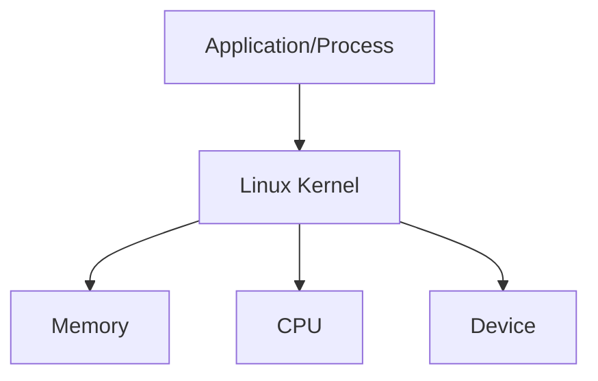

# Linux Core concepts

## Introdution to the Linux Kernel

- The kernel is responsible for 4 major tasks

1. **Memory Management** - keeps track of how much memory is used to store, what and where.
2. **Process Management** - determine which processes can use the CPU, when and how long/
3. **Device Driver** - acts as a mediator or an interpreter between the hardware and processes.
4. **System call and security** - receive the request for service from the processes.

- Kernel is monolithic - Kernel carries out CPU scheduling, memory management, and other ops by itself.
- Kernel is modular - it can extend its capabilities by use of kernel modules and dynamically loading them.

### memory management

- Memory is divided into 2 pieces/areas
  1. Kernel space
  2. User space.
- refer to this image below. Kernel space is strictly for the Kernel to use the memory to run kernel related stuff. and this takes higher priority over user space.
  

* How does User space (memory) work? \* code is loaded on the memory. i.e process is running
  

### working with hardware

- lsblk
- lspci
- lscpu
- lsmem --summary
- free -m
- lshw
- dmesg

## Kernel space and user space

## Working with hardware

## Linux boot sequence

## SystemD targets (runlevles)

## Filesystem hierarchy
