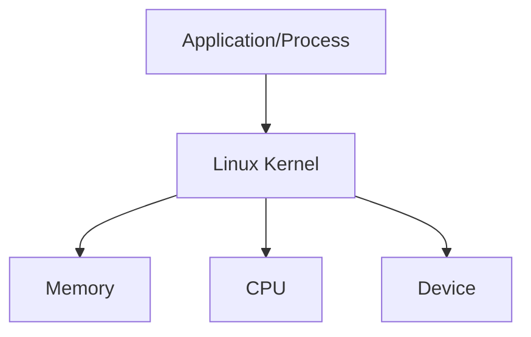

# Linux Core concepts

## Introdution to the Linux Kernel

```mermaid
graph TD
    A[Application/Process] --> B[Linux Kernel]
    B --> C[Memory]
    B --> D[CPU]
    B --> E[Device]
```

## Kernel space and user space

## Working with hardware

## Linux boot sequence

## SystemD targets (runlevles)

## Filesystem hierarchy
