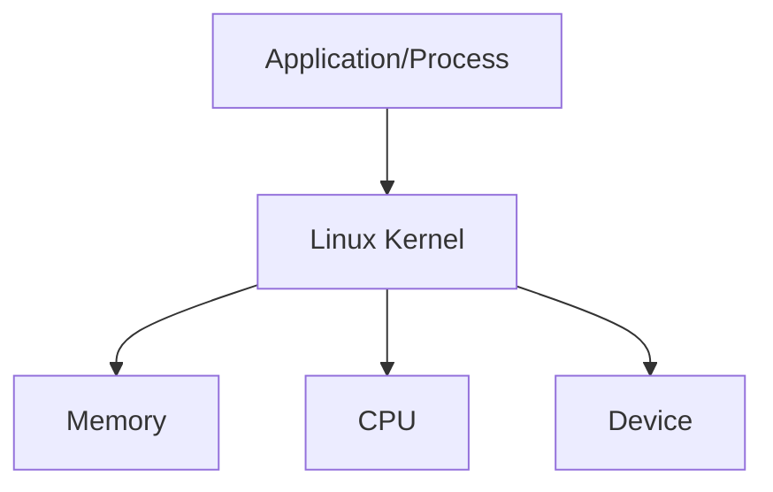

# Linux Core concepts

## Introdution to the Linux Kernel

- uname -r - gives the kernel version running on the machine

- The kernel is responsible for 4 major tasks

1. **Memory Management** - keeps track of how much memory is used to store, what and where.
2. **Process Management** - determine which processes can use the CPU, when and how long/
3. **Device Driver** - acts as a mediator or an interpreter between the hardware and processes.
4. **System call and security** - receive the request for service from the processes.

- Kernel is monolithic - Kernel carries out CPU scheduling, memory management, and other ops by itself.
- Kernel is modular - it can extend its capabilities by use of kernel modules and dynamically loading them.

### memory management

- Memory is divided into 2 pieces/areas
  1. Kernel space
  2. User space.
- refer to this image below. Kernel space is strictly for the Kernel to use the memory to run kernel related stuff. and this takes higher priority over user space.
  

* How does User space (memory) work? \* code is loaded on the memory. i.e process is running
  

### working with hardware

- lsblk
- lspci
- lscpu
- lsmem --summary
- free -m
- lshw
- dmesg

## Linux boot sequence

- The Linux boot process is divided into four key stages:

1. BIOS POST:
   The system performs a Power-On Self Test (POST) to check hardware functionality and initialize basic components.
2. BOOT Loader (GRUB2):
   The bootloader (e.g., GRUB2) is responsible for loading the Linux kernel into memory and passing control to it.
3. Kernel Initialization:
   The Linux kernel initializes hardware, mounts the root filesystem, and prepares the system for user-space processes.
4. INIT Process (systemd):
   The systemd process (or another init system) starts and manages all user-space services and processes.

## SystemD targets (runlevles)

| Runlevel | Description                 | systemd Target    |
| -------- | --------------------------- | ----------------- |
| 0        | Halt (shutdown)             | poweroff.target   |
| 1        | Single-user mode            | rescue.target     |
| 2        | Multi-user mode without NFS | multi-user.target |
| 3        | Full multi-user mode        | multi-user.target |
| 4        | Undefined (custom use)      | multi-user.target |
| 5        | Multi-user mode with GUI    | graphical.target  |
| 6        | Reboot                      | reboot.target     |

## Filesystem hierarchy

- Everything is a file in linux
- regular files
- Directory files
- Special files

* do an ls -ld and the first character will show the file type.
* file types are below and their symbol

  | Symbol | File Type        | Description                                              |
  | ------ | ---------------- | -------------------------------------------------------- |
  | `-`    | Regular file     | A standard file containing data or code.                 |
  | `d`    | Directory        | A folder containing other files or directories.          |
  | `l`    | Symbolic link    | A shortcut pointing to another file or directory.        |
  | `b`    | Block device     | A file representing a block device (e.g., disk).         |
  | `c`    | Character device | A file representing a character device (e.g., terminal). |
  | `p`    | Named pipe       | A file used for inter-process communication.             |
  | `s`    | Socket           | A file used for network communication.                   |

* we can also do a `file <file name>` to see the file type

| Directory | Description                                                                   |
| --------- | ----------------------------------------------------------------------------- |
| `/`       | Root directory, the top-level directory of the filesystem hierarchy.          |
| `/home`   | Contains user home directories, where personal files and settings are stored. |
| `/lib`    | Contains shared libraries and kernel modules required by the system.          |
| `/var`    | Stores variable data such as logs, caches, and spool files.                   |
| `/etc`    | Contains system configuration files and scripts.                              |
