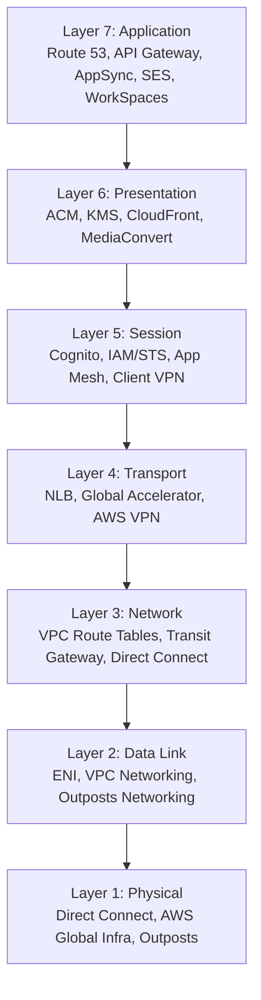

# Networking basics and brushup

## OSI layers mapped to AWS Services.

# OSI Model Mapped to AWS Services

| **OSI Layer**       | **Function**                                             | **AWS Examples**                                                                                                                                                         |
| ------------------- | -------------------------------------------------------- | ------------------------------------------------------------------------------------------------------------------------------------------------------------------------ |
| **7. Application**  | User-facing protocols (HTTP, DNS, SMTP, APIs).           | - Amazon Route 53 (DNS) - API Gateway (API mgmt) - AppSync (GraphQL APIs) - SES (email) - WorkSpaces / AppStream (app delivery)                              |
| **6. Presentation** | Data translation, encryption, compression.               | - AWS Certificate Manager (TLS/SSL) - KMS (encryption keys) - CloudFront (TLS termination, compression) - Elastic Transcoder / MediaConvert (format conversion) |
| **5. Session**      | Session control, authentication, connections.            | - Cognito (auth/session tokens) - IAM / STS (temporary credentials) - App Mesh (service-to-service sessions) - AWS Client VPN (VPN sessions)                    |
| **4. Transport**    | Reliable delivery, segmentation, flow control (TCP/UDP). | - Elastic Load Balancer (NLB) - Global Accelerator (TCP/UDP acceleration) - AWS VPN (UDP-based tunnels)                                                            |
| **3. Network**      | Logical addressing, routing, forwarding (IP).            | - VPC Route Tables - Transit Gateway - VPC Peering / Cloud WAN - Direct Connect                                                                                 |
| **2. Data Link**    | MAC addressing, switching, ARP, error detection.         | - ENI (Elastic Network Interfaces) - VPC Networking (handles ARP, L2 abstractions) - AWS Outposts Networking                                                       |
| **1. Physical**     | Transmission of raw bits (cables, fiber, RF).            | - Direct Connect (fiber links) - AWS Global Infrastructure (data centers, AZ links) - Outposts (edge hardware)                                                     |

# OSI Model vs AWS Services (Visual)

