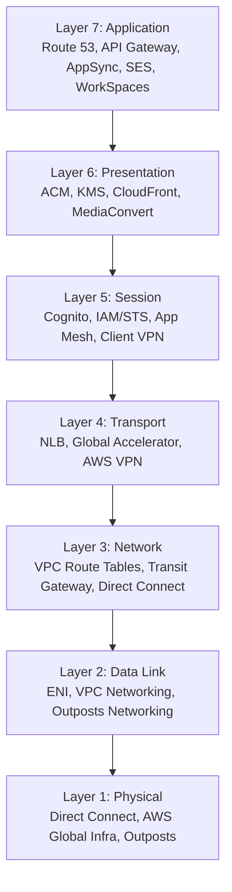
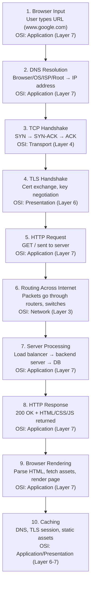

# Networking basics and brushup

## Quick Memory Hook for OSI Layers

```
All People Seem To Need Data Processing
(Application, Presentation, Session, Transport, Network, Data Link, Physical)

```

# OSI Model Mapped to AWS Services

| **OSI Layer**       | **Function**                                             | **AWS Examples**                                                                                                                                                         |
| ------------------- | -------------------------------------------------------- | ------------------------------------------------------------------------------------------------------------------------------------------------------------------------ |
| **7. Application**  | User-facing protocols (HTTP, DNS, SMTP, APIs).           | - Amazon Route 53 (DNS)<br>- API Gateway (API mgmt)<br>- AppSync (GraphQL APIs)<br>- SES (email)<br>- WorkSpaces / AppStream (app delivery)                              |
| **6. Presentation** | Data translation, encryption, compression.               | - AWS Certificate Manager (TLS/SSL)<br>- KMS (encryption keys)<br>- CloudFront (TLS termination, compression)<br>- Elastic Transcoder / MediaConvert (format conversion) |
| **5. Session**      | Session control, authentication, connections.            | - Cognito (auth/session tokens)<br>- IAM / STS (temporary credentials)<br>- App Mesh (service-to-service sessions)<br>- AWS Client VPN (VPN sessions)                    |
| **4. Transport**    | Reliable delivery, segmentation, flow control (TCP/UDP). | - Elastic Load Balancer (NLB)<br>- Global Accelerator (TCP/UDP acceleration)<br>- AWS VPN (UDP-based tunnels)                                                            |
| **3. Network**      | Logical addressing, routing, forwarding (IP).            | - VPC Route Tables<br>- Transit Gateway<br>- VPC Peering / Cloud WAN<br>- Direct Connect                                                                                 |
| **2. Data Link**    | MAC addressing, switching, ARP, error detection.         | - ENI (Elastic Network Interfaces)<br>- VPC Networking (handles ARP, L2 abstractions)<br>- AWS Outposts Networking                                                       |
| **1. Physical**     | Transmission of raw bits (cables, fiber, RF).            | - Direct Connect (fiber links)<br>- AWS Global Infrastructure (data centers, AZ links)<br>- Outposts (edge hardware)                                                     |

## OSI Model vs AWS Services (Visual)



## Load Balancers mapped to OSI layer

| **Load Balancer**                          | **OSI Layer**             | **Function**                                                                                                         |
| ------------------------------------------ | ------------------------- | -------------------------------------------------------------------------------------------------------------------- |
| **Application Load Balancer (ALB)**        | **Layer 7 – Application** | Operates at HTTP/HTTPS, supports path-based & host-based routing, WebSockets, redirects, WAF integration.            |
| **Network Load Balancer (NLB)**            | **Layer 4 – Transport**   | Operates at TCP/UDP/TLS level, ultra-low latency, supports millions of requests per second, static IPs.              |
| **Gateway Load Balancer (GWLB)**           | **Layer 3 – Network**     | Operates at IP packet level, routes traffic to 3rd-party virtual appliances (firewalls, IDS/IPS, packet inspection). |
| **Classic Load Balancer (CLB)** _(legacy)_ | **Layer 4 & Layer 7**     | Old gen — can do basic TCP (L4) and HTTP/HTTPS (L7), but lacks advanced routing features.                            |

## What happens when we hit www.google.com in our browser

### URL Request Flow with OSI Layer Mapping



## BGP (Border Gateway Protocol)

- It is the protocol which makes the internet work.

```
Think of the Internet as a huge web of thousands of independent networks (ISPs, cloud providers, large enterprises).
Each of these is an Autonomous System (AS) — a network managed by one organization.

BGP is how these systems talk to each other and decide the best paths for sending data.

```

#### How it works?

- Routers exchange routes using BGP messages.
- Each route advertisement says:
  - “To reach network X, send traffic to me — and here’s the path I’ll take.”
- Routers then choose the best path based on rules like:
  - AS path length (fewer hops = better)
  - Local preference
  - MED (Multi-Exit Discriminator)
  - Route origin type, etc.

#### Types of BGP

- eBGP - external BGP, that is how internet works.
- iBGP - internal BGP, that is how things work within an organisation.

## ECMP (Equal cost MultiPath Routing)

- in this case, a router picks one best route to a destination (based on lowest cost/metric). With ECMP, if there are multiple equally good routes, the router can use all of them at the same time.
  Example:
  If there are two links between your datacenter and AWS — both 10 Gbps and equal cost — ECMP will send traffic across both instead of wasting one as backup.

#### How it works?

- The router has multiple next hops (paths) with equal cost in its routing table.
- It uses a hashing algorithm (based on source/destination IP, port, etc.) to decide which path each flow uses.
- This keeps packets in the same session on the same path (avoiding packet reordering).
- If one path fails, traffic is automatically shifted to the remaining paths.
