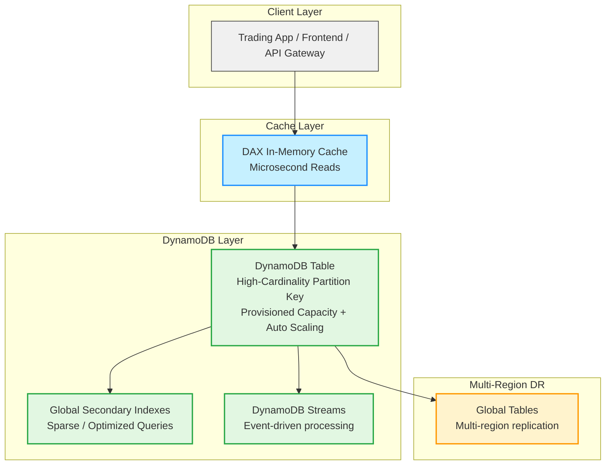

# Potential questions

## How would you design a highly available ECS or EC2 deployment for trading platform? (Highly Available ECS/EC2 Deployment)

## High frequency DynamoDB with cost efficency in mind.

