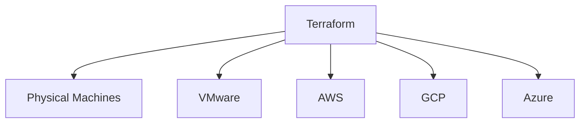
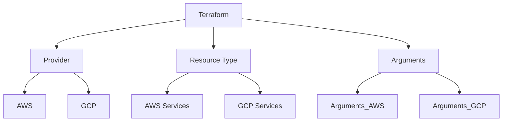
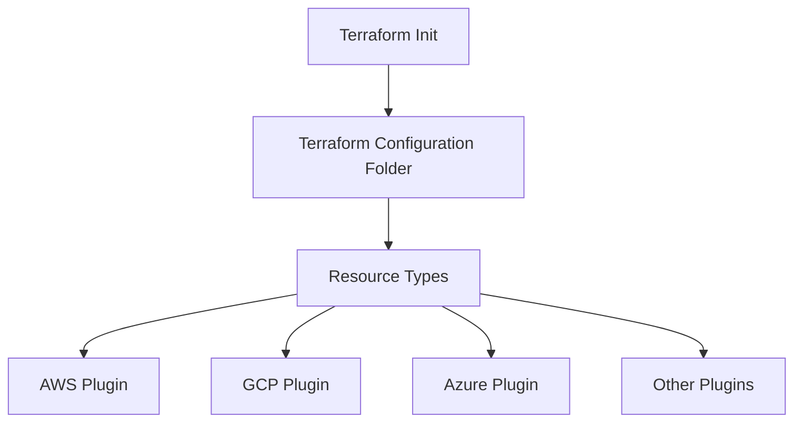

# Terraform basics

### Tools available in market for IAC, templating and configuration management

1. Docker
2. Terraform (Hashicorp)
3. Ansible
4. Cloudformation
5. Packer (Hashicorp)
6. Puppet
7. Saltstack
8. Vagrant (Hashicorp) and more

| Configuration Management | Server Templating | Provisioning Tools |
| ------------------------ | ----------------- | ------------------ |
| Ansible                  | Docker            | Terraform          |
| Puppet                   | Packer            | Cloudformation     |
| SaltStack                | Vagrant           |                    |

## Why Terraform?



- TF uses HCL - "Hashicorp Configuration language".

* States - init, plan, apply
* it is a declarative language.
* resources are the serices in cloud
* TF state stores the blueprint of infra created by TF. terraform.tfstate (file)
* TF can import the resources created outside the TF via manual or other means and give us better control over the resources.

### Installing TF on macos

```
brew tap hashicorp/tap
brew install hashicorp/tap/terraform
```

```
terraform -version
```

```
brew upgrade hashicorp/tap/terraform
```

- what is a resource?
  An object that the TF manages. It can be anything e.g. EC2, DB etc.

## Basics of HCL

- HCL Syntax

```
<block> <parameters> {
    key1 = value1
    key2 = values2
}
```

## What each line means?

- Refer to the image below


- local will be replaced by cloud provider i.e. aws, gcp, azure etc.
- file will be replaced by the resource type i.e. ec2, spanner etc.

* A terraform workflow consists of 4 steps.

1. write the config file.
2. init i.e. terraform init
3. plan i.e. terraform plan
4. Apply i.e. terraform apply

### mapping of each line in hcl



### updating and destroying resources

- make a change to the main.tf.
- terrform plan and then goto apply.
- terraform destroy will destroy/delete the resource

## Using TF providers

- when terraform init is run in TF config folder, terraform downloads the plugins based on the resources type such as Aws, gcp, azure etc

* registry.terraform.io
* there are 3 tiers of provider.
  1. Official such as AWS, GCP, Azure, local etc.
  2. Partners such as heroku, digitalocean, bigip etc.
  3. Community such as netapp, emc, ucloud etc.
* plugins are stored in

```
~terraform/.terraform/providers/registry.terraform.io/hashicorp/local/2.5.3/darwin_arm64

```



### configuration directory

| File Name    | Purpose                                         |
| ------------ | ----------------------------------------------- |
| main.tf      | Main config file containing resource definition |
| variables.tf | contains variable declarations                  |
| outputs.tf   | Contains outputs from resource                  |
| provider.tf  | Contains provider definition                    |

## Multiple providers

## Input variables

- we create a variables.tf

* type is optional.
* if nothing is mentioned for type "any" is used.

```
var "<argument>"{
    default = ""
    type = string|number|bool|any|list|map|set|objects|tuples
    description= <>
}
```

| Type   | Description                                     |
| ------ | ----------------------------------------------- |
| string | Represents a single string value                |
| number | Represents a numeric value                      |
| bool   | Represents a boolean value (true/false)         |
| any    | Accepts any type of value                       |
| list   | Represents a collection of values in a sequence |
| map    | Represents a collection of key-value pairs      |
| set    | Represents a collection of unique values        |
| object | Represents a complex type with named attributes |
| tuple  | Represents a sequence of values of fixed types  |

## Variable definition files.

- terraform.tfvars - tfvars can be a var definition file
- terraform.tfvars.json

* terraform.auto.tfvars
* terraform.auto.tfvars.json

```
filename = "/root/big/pet.txt"
content = "We love pets!"
prefix = "Mr."
separator = "."
length = "2"
```

## variable definition precedence

| Precedence Order | Source                                  | Description                                                               |
| ---------------- | --------------------------------------- | ------------------------------------------------------------------------- |
| 1                | Command-line `-var` or `-var-file` flag | Variables passed directly via CLI take the highest precedence.            |
| 2                | `terraform.tfvars` file                 | Default variable definition file in the working directory.                |
| 3                | `terraform.tfvars.json` file            | JSON format variable definition file in the working directory.            |
| 4                | `*.auto.tfvars` files                   | Automatically loaded variable files in the working directory.             |
| 5                | Environment variables                   | Variables defined with the `TF_VAR_` prefix in the environment.           |
| 6                | Default values in `variables.tf`        | Default values specified in the variable block in the configuration file. |

## Resource attributes

- helps when there is dependencies between resources.

```
    resources "local_file" "pet" {
        filename = var.filename
        content = "My favourite per is ${random_pet.my-pet.id}
    }

    resource "random_pet" "my-pet" {
        prefix = var.prefix
        separator = var.separator
        length = var.lengtjh
    }

```

## Reference dependencies

- TF is smart to understand the dependencies. i.e. implicit dependency
- however, we can define it too i.e. explicit dependency

```
    resources "local_file" "pet" {
        filename = var.filename
        content = "My favourite per is ${random_pet.my-pet.id}

        depends_on = [
            random_pet.my-pet
        ]
    }

    resource "random_pet" "my-pet" {
        prefix = var.prefix
        separator = var.separator
        length = var.lengtjh
    }

```

## output variables

```
    resources "local_file" "pet" {
        filename = var.filename
        content = "My favourite per is ${random_pet.my-pet.id}

        depends_on = [
            random_pet.my-pet
        ]
    }

    resource "random_pet" "my-pet" {
        prefix = var.prefix
        separator = var.separator
        length = var.lengtjh
    }

    output "pet-name"{
        value = random_pet.my-pet.id
        description = "Record the value of pet ID generated by the random_pet resource"
    }
```

- Syntax for output is

```
output "variable_name"{
    value = "<variable_value>"
    <arguments>
}
```

## Terraform State

- its mandatory
- store the relflection of config files
- remote storage is required when working in team setup as the state files keep updating and will lead to confusion.
- example - s3, gcp bucket, hashicorp consul etc.

## Terraform Commands

- terraform validate - can be used to check the syntax and other details.
- terraform fmt - formats the code into canonical format
- terraform state - shows the current state of the resources and its details
- terroform state -json
- terraform providers - shows all the providers.
- terrform output - prints the resource details on screen
- terraform graph - maps the execution plan. Output can be visualised by using graphviz.
  install graphviz
  terraform graph | dot -Tsvg > graph.svg

## immutable and mutaable infra

- mutable - not good. its inplace upgrades and changes. Eventually it gets hard to manage the resource and may result in config drift.
- immutable - good. we remove the old infra and create a new one in its place.

## Lifecycle rules

- create_before_destroy = true

```
 resources "local_file" "pet" {
        filename = var.filename
        content = "My favourite per is ${random_pet.my-pet.id}

        lifecycle {
            create_before_destroy = true
            prevent_destroy = true  //or it can be
        }
    }

```

| Lifecycle Rule          | Description                                                                               |
| ----------------------- | ----------------------------------------------------------------------------------------- |
| `create_before_destroy` | Ensures new resources are created before the old ones are destroyed.                      |
| `prevent_destroy`       | Prevents the resource from being destroyed, even if it is removed from the configuration. |
| `ignore_changes`        | Specifies resource attributes to ignore during updates to prevent unintended changes.     |

## Data Sources

- if the resources are created via non terraform stack, they can be pulled under TF to readonly.
- below diagram shows how thats possible
  

| Resources                        | Data Sources          |
| -------------------------------- | --------------------- |
| Keyword : resources              | Keyword : data        |
| Creates, Updates, Destroys Infra | Read Only infra       |
| Also clled maanged resources     | Called data resources |

## Meta arguments

- Lifecycle
- count
- depends on
- example below

```
    resource "local_fiel" "pet" {
        filename = var.filename[count.index]
        count = length(var.filename)
    }

```

```
    variable "filename" {
        default = [
            "/root/pets.txt"
            "/root/dogs.txt"
            "/root/cats.txt"
        ]
    }

```

| Function | Description                                               | Example Input               | Example Output |
| -------- | --------------------------------------------------------- | --------------------------- | -------------- |
| `length` | Returns the number of elements in a list, map, or string. | `length(["a", "b", "c"])`   | `3`            |
|          |                                                           | `length({"key1" = "val1"})` | `1`            |
|          |                                                           | `length("hello")`           | `5`            |

- Scenario
  1. If I have 3 instances to be created i.e. pet, cats and dogs.
  2. I can use the count in main.tf and variable file can have the list of instances.
  3. if i need to remove one of the resources i.e. pet or cats or dogs. then all of them will be either be
     - deleted and replaced
     - deleted.
  4. They will be deleted or deleted and replaced because , they are in a list (data type) and the index will change for these resources. When TF plan/apply is done, TF will see it as new resouce, hence it will mark it to delete and replace.
  5. To avoid this recreation and deletion. we can use "for_each". but this will only work on "set or map" data types in variable.
  6. "toset" wil convert the type(string) to type(set).

```
 resource "local_fiel" "pet" {
        filename = each.value
        for_each = toset(var.filename)
    }
```

```
    variable "filename" {
        type = list(string)
        default = [
            "/root/pets.txt"
            "/root/dogs.txt"
            "/root/cats.txt"
        ]
    }

```
