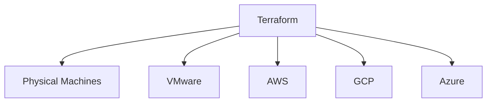

# Terraform basics

### Tools available in market for IAC, templating and configuration management

1. Docker
2. Terraform (Hashicorp)
3. Ansible
4. Cloudformation
5. Packer (Hashicorp)
6. Puppet
7. Saltstack
8. Vagrant (Hashicorp) and more

| Configuration Management | Server Templating | Provisioning Tools |
| ------------------------ | ----------------- | ------------------ |
| Ansible                  | Docker            | Terraform          |
| Puppet                   | Packer            | Cloudformation     |
| SaltStack                | Vagrant           |                    |

## Why Terraform?



- TF uses HCL - "Hashicorp Configuration language".

* States - init, plan, apply
* it is a declarative language.
* resources are the serices in cloud
* TF state stores the blueprint of infra created by TF. terraform.tfstate (file)
* TF can import the resources created outside the TF via manual or other means and give us better control over the resources.

### Installing TF on macos

```
brew tap hashicorp/tap
brew install hashicorp/tap/terraform
```

```
terraform -version
```

```
brew upgrade hashicorp/tap/terraform
```
