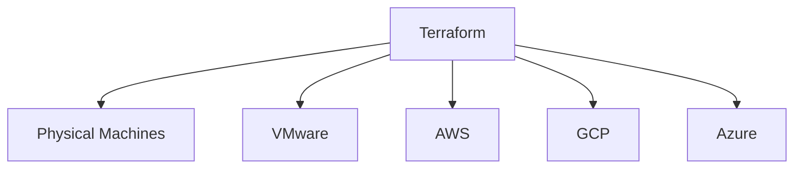
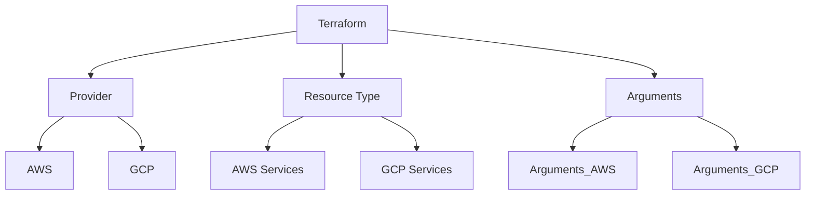

# Terraform basics

### Tools available in market for IAC, templating and configuration management

1. Docker
2. Terraform (Hashicorp)
3. Ansible
4. Cloudformation
5. Packer (Hashicorp)
6. Puppet
7. Saltstack
8. Vagrant (Hashicorp) and more

| Configuration Management | Server Templating | Provisioning Tools |
| ------------------------ | ----------------- | ------------------ |
| Ansible                  | Docker            | Terraform          |
| Puppet                   | Packer            | Cloudformation     |
| SaltStack                | Vagrant           |                    |

## Why Terraform?



- TF uses HCL - "Hashicorp Configuration language".

* States - init, plan, apply
* it is a declarative language.
* resources are the serices in cloud
* TF state stores the blueprint of infra created by TF. terraform.tfstate (file)
* TF can import the resources created outside the TF via manual or other means and give us better control over the resources.

### Installing TF on macos

```
brew tap hashicorp/tap
brew install hashicorp/tap/terraform
```

```
terraform -version
```

```
brew upgrade hashicorp/tap/terraform
```

- what is a resource?
  An object that the TF manages. It can be anything e.g. EC2, DB etc.

## Basics of HCL

- HCL Syntax

```
<block> <parameters> {
    key1 = value1
    key2 = values2
}
```

## What each line means?

- Refer to the image below


- local will be replaced by cloud provider i.e. aws, gcp, azure etc.
- file will be replaced by the resource type i.e. ec2, spanner etc.

* A terraform workflow consists of 4 steps.

1. write the config file.
2. init i.e. terraform init
3. plan i.e. terraform plan
4. Apply i.e. terraform apply

### mapping of each line in hcl



### updating and destroying resources

- make a change to the main.tf.
- terrform plan and then goto apply.
- terraform destroy will destroy/delete the resource
